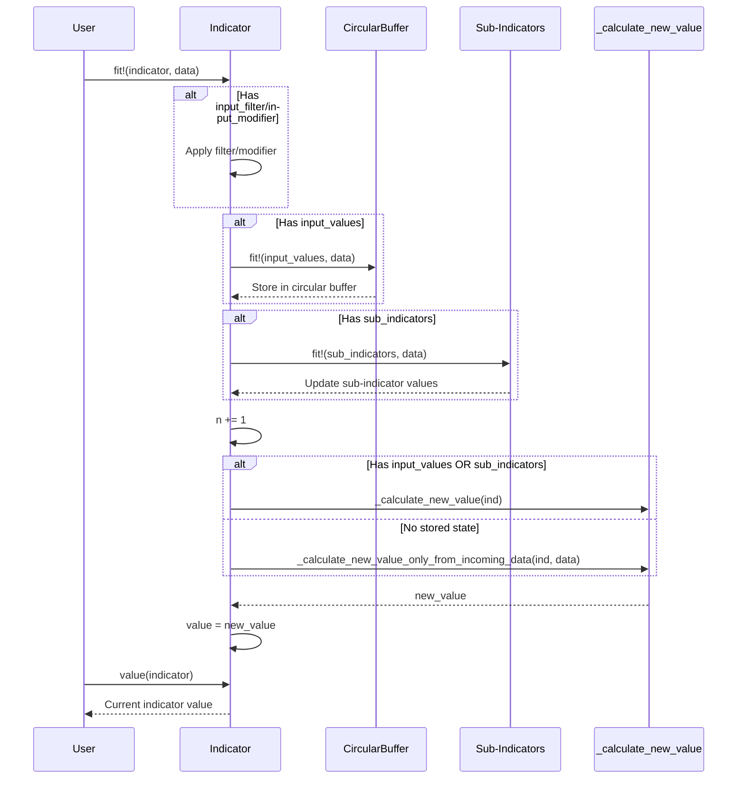

# OnlineTechnicalIndicators.jl - Project Documentation

> A Julia library for computing technical analysis indicators using online (streaming) algorithms.

## Table of Contents

- [Project Overview](#project-overview)
- [Architecture](#architecture)
- [Project Structure](#project-structure)
- [Core Components](#core-components)
- [Indicator Categories](#indicator-categories)
- [Data Flow](#data-flow)
- [API Reference](#api-reference)
- [Configuration](#configuration)
- [Getting Started](#getting-started)
- [Development Guide](#development-guide)

---

## Project Overview

**OnlineTechnicalIndicators.jl** implements technical analysis indicators using [online algorithms](https://en.wikipedia.org/wiki/Online_algorithm), allowing efficient streaming computation without requiring the entire dataset in memory.

### Tech Stack

| Component | Technology |
|-----------|------------|
| Language | Julia 1.10+ |
| Core Dependencies | OnlineStatsBase.jl, OnlineStatsChains.jl |
| Data Interface | Tables.jl |
| Documentation | Documenter.jl |

### Key Features

- **Streaming computation**: Process data point-by-point without storing full history
- **Memory efficient**: Uses circular buffers for fixed-size rolling windows
- **Type-safe**: Parameterized types for flexible numeric precision
- **Composable**: Build complex indicators from simpler components
- **Tables.jl integration**: Works with any Tables.jl-compatible data source

---

## Architecture

```mermaid
flowchart TB
    subgraph OnlineTechnicalIndicators
        Main[OnlineTechnicalIndicators.jl]

        subgraph Submodules
            Candlesticks[Candlesticks]
            Internals[Internals]
            Indicators[Indicators]
            Patterns[Patterns]
            Wrappers[Wrappers]
            Factories[Factories]
            SampleData[SampleData]
        end

        subgraph BaseTypes["Abstract Types"]
            TI[TechnicalIndicator{T}]
            TISO[TechnicalIndicatorSingleOutput{T}]
            TIMO[TechnicalIndicatorMultiOutput{T}]
            MAI[MovingAverageIndicator{T}]
        end
    end

    subgraph External["External Dependencies"]
        OSB[OnlineStatsBase.jl]
        OSC[OnlineStatsChains.jl]
        Tables[Tables.jl]
    end

    Main --> Submodules
    TI --> OSB
    BaseTypes --> TI
    TISO --> TI
    TIMO --> TI
    MAI --> TISO

    Indicators --> BaseTypes
    Patterns --> BaseTypes
    Wrappers --> Indicators
    Factories --> Indicators
```

### Type Hierarchy

```mermaid
classDiagram
    class OnlineStat~T~ {
        <<OnlineStatsBase>>
    }

    class TechnicalIndicator~T~ {
        <<abstract>>
        +value
        +n::Int
    }

    class TechnicalIndicatorSingleOutput~T~ {
        <<abstract>>
        +value::Union{Missing,T}
    }

    class TechnicalIndicatorMultiOutput~T~ {
        <<abstract>>
        +value::Union{Missing,*Val}
    }

    class MovingAverageIndicator~T~ {
        <<abstract>>
    }

    OnlineStat <|-- TechnicalIndicator
    TechnicalIndicator <|-- TechnicalIndicatorSingleOutput
    TechnicalIndicator <|-- TechnicalIndicatorMultiOutput
    TechnicalIndicatorSingleOutput <|-- MovingAverageIndicator
```

---

## Project Structure

```
OnlineTechnicalIndicators/
├── src/
│   ├── OnlineTechnicalIndicators.jl    # Main module entry point
│   ├── stats.jl                        # Statistical utilities
│   ├── sample_data.jl                  # Sample OHLCV data for testing
│   ├── resample.jl                     # Time-series resampling utilities
│   │
│   ├── candlesticks/                   # OHLCV data structures
│   │   ├── Candlesticks.jl             # Submodule definition
│   │   └── ohlcv.jl                    # OHLCV struct and OHLCVFactory
│   │
│   ├── internals/                      # Internal utilities
│   │   └── Internals.jl                # Helper functions for indicators
│   │
│   ├── indicators/                     # Technical indicators (60+)
│   │   ├── Indicators.jl               # Submodule definition
│   │   ├── SMA.jl, EMA.jl, ...         # SISO indicators
│   │   ├── BB.jl, MACD.jl, ...         # SIMO indicators
│   │   ├── ATR.jl, OBV.jl, ...         # MISO indicators
│   │   └── Stoch.jl, ADX.jl, ...       # MIMO indicators
│   │
│   ├── patterns/                       # Candlestick patterns (13)
│   │   ├── Patterns.jl                 # Submodule definition
│   │   ├── PatternTypes.jl             # Pattern enumerations
│   │   ├── PatternValues.jl            # Pattern value types
│   │   ├── Doji.jl, Hammer.jl, ...     # Single candle patterns
│   │   ├── Engulfing.jl, Harami.jl     # Two candle patterns
│   │   └── Star.jl, ThreeInside.jl     # Three candle patterns
│   │
│   ├── wrappers/                       # Indicator wrappers
│   │   ├── Wrappers.jl                 # Submodule definition
│   │   ├── dag.jl                      # DAGWrapper for StatDAG
│   │   └── smoother.jl                 # Generic smoothing wrapper
│   │
│   ├── factories/                      # Factory functions
│   │   ├── Factories.jl                # Submodule definition
│   │   └── MovingAverage.jl            # MA factory
│   │
│   └── other/                          # Integration utilities
│       ├── arrays_indicators.jl        # Array convenience functions
│       ├── tables_indicators.jl        # Tables.jl integration
│       └── iterators.jl                # Iterator support
│
├── test/                               # Test suite
│   ├── runtests.jl                     # Test entry point
│   └── test_*.jl                       # Individual test files
│
├── docs/                               # Documentation
│   ├── make.jl                         # Documenter.jl build script
│   └── src/                            # Documentation source
│
└── Project.toml                        # Package dependencies
```

---

## Core Components

### 1. Candlesticks Module

Provides OHLCV (Open, High, Low, Close, Volume) data structures.

```julia
using OnlineTechnicalIndicators.Candlesticks

# Create a single candlestick
candle = OHLCV(100.0, 105.0, 98.0, 103.0; volume=1000.0, time=Date(2024,1,1))

# Create multiple candlesticks from vectors
factory = OHLCVFactory(opens, highs, lows, closes; volume=volumes, time=times)
candles = collect(factory)
```

**Key Types:**
- `OHLCV{Ttime,Tprice,Tvol}`: Candlestick data structure
- `OHLCVFactory`: Factory for batch OHLCV creation
- `ValueExtractor`: Module with extraction functions (`extract_open`, `extract_close`, etc.)

### 2. Internals Module

Internal utilities for indicator implementation (advanced use).

**Exported Functions:**
- `is_multi_input(T)`: Check if indicator requires OHLCV input
- `is_multi_output(T)`: Check if indicator produces multiple values
- `expected_return_type(ind)`: Get return type of an indicator
- `has_output_value(ind)`: Check if indicator has valid output
- `has_valid_values(buf, window)`: Check circular buffer validity
- `is_valid(x)`: Check if value is not missing

### 3. Indicators Module

Contains 60+ technical indicators organized by input/output type.

### 4. Patterns Module

Contains 13 candlestick pattern detectors organized by candle count.

### 5. Wrappers Module

Provides wrapper types for composing indicators.

**Key Types:**
- `Smoother`: Applies moving average to any indicator's output
- `DAGWrapper`: Integrates StatDAG for complex indicator compositions

### 6. Factories Module

Factory functions for creating indicator instances.

**Key Types:**
- `MovingAverage`: Factory for creating typed moving average indicators
- `MAFactory`: Deprecated alias for `MovingAverage`

---

## Indicator Categories

### SISO (Single Input, Single Output)

Indicators that take a single price value and produce a single output.

| Indicator | Description |
|-----------|-------------|
| `SMA` | Simple Moving Average |
| `EMA` | Exponential Moving Average |
| `SMMA` | Smoothed Moving Average |
| `WMA` | Weighted Moving Average |
| `DEMA` | Double Exponential Moving Average |
| `TEMA` | Triple Exponential Moving Average |
| `KAMA` | Kaufman Adaptive Moving Average |
| `HMA` | Hull Moving Average |
| `ALMA` | Arnaud Legoux Moving Average |
| `ZLEMA` | Zero-Lag EMA |
| `McGinleyDynamic` | McGinley Dynamic |
| `T3` | Tillson T3 |
| `RSI` | Relative Strength Index |
| `ROC` | Rate of Change |
| `DPO` | Detrended Price Oscillator |
| `CoppockCurve` | Coppock Curve |
| `MeanDev` | Mean Deviation |
| `StdDev` | Standard Deviation |
| `TRIX` | Triple Smooth EMA Rate of Change |
| `TSI` | True Strength Index |

### SIMO (Single Input, Multiple Output)

Indicators that take a single price value and produce multiple outputs.

| Indicator | Output Type | Fields |
|-----------|-------------|--------|
| `BB` | `BBVal` | `upper`, `central`, `lower` |
| `MACD` | `MACDVal` | `macd`, `signal`, `histogram` |
| `StochRSI` | `StochRSIVal` | `k`, `d` |
| `KST` | `KSTVal` | `kst`, `signal` |

### MISO (Multiple Input, Single Output)

Indicators that take OHLCV data and produce a single output.

| Indicator | Description |
|-----------|-------------|
| `TrueRange` | True Range |
| `ATR` | Average True Range |
| `NATR` | Normalized ATR |
| `AccuDist` | Accumulation/Distribution |
| `OBV` | On Balance Volume |
| `SOBV` | Smoothed OBV |
| `MFI` | Money Flow Index |
| `BOP` | Balance of Power |
| `CCI` | Commodity Channel Index |
| `ChaikinOsc` | Chaikin Oscillator |
| `VWMA` | Volume Weighted Moving Average |
| `VWAP` | Volume Weighted Average Price |
| `AO` | Awesome Oscillator |
| `ForceIndex` | Force Index |
| `EMV` | Ease of Movement |
| `MassIndex` | Mass Index |
| `CHOP` | Choppiness Index |
| `KVO` | Klinger Volume Oscillator |
| `UO` | Ultimate Oscillator |
| `IntradayRange` | Intraday Range |
| `RelativeIntradayRange` | Relative Intraday Range |
| `ADR` | Average Daily Range |
| `ARDR` | Average Relative Daily Range |

### MIMO (Multiple Input, Multiple Output)

Indicators that take OHLCV data and produce multiple outputs.

| Indicator | Output Type | Description |
|-----------|-------------|-------------|
| `Stoch` | `StochVal` | Stochastic Oscillator |
| `ADX` | `ADXVal` | Average Directional Index |
| `SuperTrend` | `SuperTrendVal` | SuperTrend |
| `VTX` | `VTXVal` | Vortex Indicator |
| `DonchianChannels` | `DonchianChannelsVal` | Donchian Channels |
| `KeltnerChannels` | `KeltnerChannelsVal` | Keltner Channels |
| `Aroon` | `AroonVal` | Aroon Indicator |
| `ChandeKrollStop` | `ChandeKrollStopVal` | Chande Kroll Stop |
| `ParabolicSAR` | `SARTrend` | Parabolic SAR |
| `SFX` | `SFXVal` | SFX Indicator |
| `TTM` | `TTMVal` | TTM Squeeze |
| `PivotsHL` | `PivotsHLVal` | Pivot High/Low |
| `GannHiloActivator` | `GannHiloActivatorVal` | Gann HiLo Activator |
| `GannSwingChart` | `GannSwingChartVal` | Gann Swing Chart |
| `PeakValleyDetector` | `PeakValleyVal` | Peak/Valley Detection |
| `RetracementCalculator` | `RetracementVal` | Retracement Levels |
| `SupportResistanceLevel` | `SupportResistanceLevelVal` | Support/Resistance |

### Candlestick Patterns

| Category | Patterns |
|----------|----------|
| Single Candle | `Doji`, `Hammer`, `ShootingStar`, `Marubozu`, `SpinningTop` |
| Two Candle | `Engulfing`, `Harami`, `PiercingDarkCloud`, `Tweezer` |
| Three Candle | `Star`, `ThreeSoldiersCrows`, `ThreeInside` |
| Composite | `CandlestickPatternDetector` (detects all patterns) |

---

## Data Flow



### Indicator Lifecycle

1. **Construction**: Initialize indicator with parameters and allocate circular buffers
2. **Warm-up Period**: Feed initial data; `value()` returns `missing` until sufficient data
3. **Active Period**: Each `fit!()` call updates the indicator and produces a valid value
4. **Rolling Computation**: Old values automatically expire from circular buffers

---

## API Reference

### Core Functions

```julia
# Create an indicator
indicator = SMA{Float64}(period=14)

# Feed data
fit!(indicator, price)

# Get current value
val = value(indicator)  # Returns Union{Missing,Float64}

# Check observation count
n = nobs(indicator)
```

### Working with OHLCV Data

```julia
using OnlineTechnicalIndicators.Indicators
using OnlineTechnicalIndicators.Candlesticks

# Create OHLCV-based indicator
atr = ATR{OHLCV{Missing,Float64,Float64}}(period=14)

# Feed candlestick data
for candle in candles
    fit!(atr, candle)
end

# Get ATR value
println(value(atr))
```

### Multi-Output Indicators

```julia
using OnlineTechnicalIndicators.Indicators

# Create MACD
macd = MACD{Float64}(fast_period=12, slow_period=26, signal_period=9)

# Feed data
for price in prices
    fit!(macd, price)
end

# Access multiple outputs
result = value(macd)  # MACDVal
println("MACD: $(result.macd)")
println("Signal: $(result.signal)")
println("Histogram: $(result.histogram)")
```

### Pattern Detection

```julia
using OnlineTechnicalIndicators.Patterns
using OnlineTechnicalIndicators.Candlesticks

# Create pattern detector
detector = CandlestickPatternDetector{OHLCV{Missing,Float64,Float64}}()

# Feed candlestick data
for candle in candles
    fit!(detector, candle)
end

# Get detected patterns
result = value(detector)  # AllPatternsVal
```

### Using Smoother Wrapper

```julia
using OnlineTechnicalIndicators.Indicators

# Create a smoother (applies SMA to TrueRange output)
smoothed_tr = Smoother(TrueRange; period=14, ma=SMA)

# Equivalent to ATR but with SMA instead of SMMA
for candle in candles
    fit!(smoothed_tr, candle)
end
println(value(smoothed_tr))
```

### Tables.jl Integration

```julia
using OnlineTechnicalIndicators.Indicators
using DataFrames  # or any Tables.jl compatible type

# Create indicator from table
df = DataFrame(Close=[100.0, 101.0, 102.0, ...])
sma_values = SMA(df; period=14)  # Returns vector of SMA values
```

---

## Configuration

### Default Parameters

Each indicator has sensible defaults. Common parameters:

| Parameter | Typical Default | Description |
|-----------|-----------------|-------------|
| `period` | 3-26 | Lookback window size |
| `ma` | `EMA` | Moving average type |
| `input_modifier_return_type` | `Float64` | Output precision type |

### Type Parameters

Indicators are parameterized for flexibility:

```julia
# Float64 precision (default)
sma = SMA{Float64}(period=14)

# Float32 for memory efficiency
sma = SMA{Float32}(period=14)

# OHLCV for multi-input indicators
atr = ATR{OHLCV{Missing,Float64,Float64}}(period=14)
```

---

## Getting Started

### Installation

```julia
using Pkg
Pkg.add("OnlineTechnicalIndicators")
```

### Quick Start

```julia
using OnlineTechnicalIndicators.Indicators
using OnlineTechnicalIndicators.Candlesticks

# Price data
prices = [100.0, 101.5, 99.8, 102.3, 101.1, 103.5]

# Single-input indicator
sma = SMA{Float64}(period=3)
for price in prices
    fit!(sma, price)
    println("SMA: $(value(sma))")
end

# OHLCV data
candles = [
    OHLCV(100.0, 102.0, 99.0, 101.0; volume=1000.0),
    OHLCV(101.0, 103.0, 100.0, 102.5; volume=1200.0),
    # ...
]

# Multi-input indicator
rsi = RSI{Float64}(period=14)
atr = ATR{OHLCV{Missing,Float64,Float64}}(period=14)

for candle in candles
    fit!(rsi, candle.close)
    fit!(atr, candle)
end
```

### Sample Data

```julia
using OnlineTechnicalIndicators.SampleData

# Access sample OHLCV data
candles = SampleData.V_OHLCV  # Vector of OHLCV
prices = SampleData.CLOSE_TMPL  # Vector of close prices

# Tables.jl compatible sample
table = SampleData.TAB_OHLCV
```

---

## Development Guide

### Implementing a New Indicator

1. **Create the indicator file** in `src/indicators/`

```julia
# src/indicators/MyIndicator.jl

const MY_INDICATOR_PERIOD = 14

"""
    MyIndicator{T}(; period = MY_INDICATOR_PERIOD)

Description of the indicator...
"""
mutable struct MyIndicator{T,IN,T2} <: TechnicalIndicatorSingleOutput{T}
    value::Union{Missing,T2}
    n::Int

    period::Int
    input_values::CircBuff

    function MyIndicator{T}(; period = MY_INDICATOR_PERIOD) where {T}
        input_values = CircBuff(T, period + 1, rev = false)
        new{T,false,T}(missing, 0, period, input_values)
    end
end

function _calculate_new_value(ind::MyIndicator)
    if ind.n >= ind.period
        # Calculate and return value
        return computed_value
    else
        return missing
    end
end
```

2. **Register in Indicators.jl**
   - Add to appropriate category list (`SISO_INDICATORS`, etc.)
   - Add `is_multi_input` definition
   - Add to exports

3. **Write tests** in `test/`

### Running Tests

```julia
using Pkg
Pkg.test("OnlineTechnicalIndicators")
```

### Building Documentation

```julia
cd("docs")
julia --project=. make.jl
```

---

## License

This project is licensed under the MIT License. See the [LICENSE](LICENSE) file for details.

## Resources

- **Documentation**: https://femtotrader.github.io/OnlineTechnicalIndicators.jl/
- **Repository**: https://github.com/femtotrader/OnlineTechnicalIndicators.jl
- **Issues**: https://github.com/femtotrader/OnlineTechnicalIndicators.jl/issues
